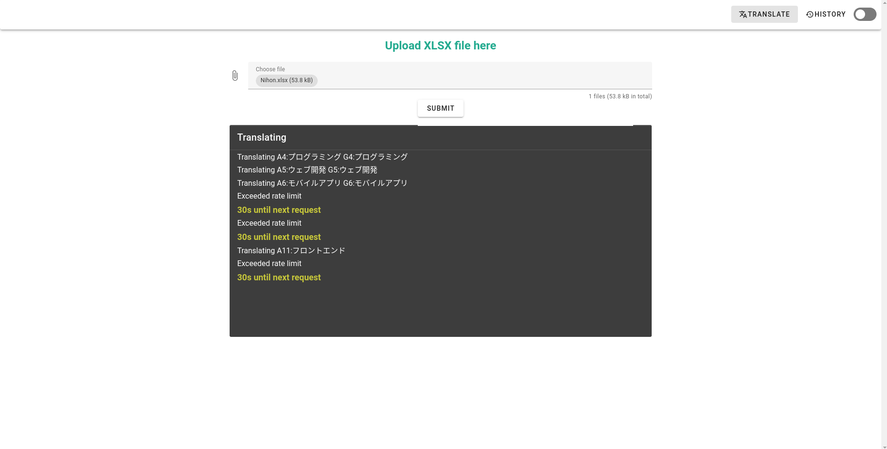
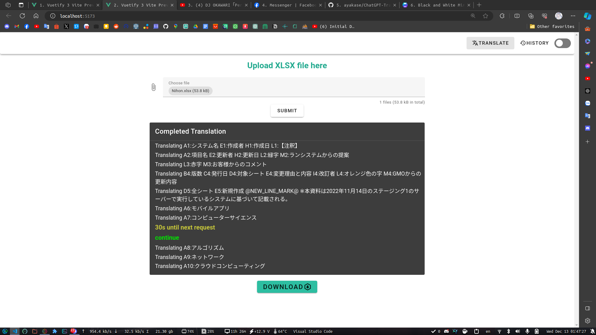
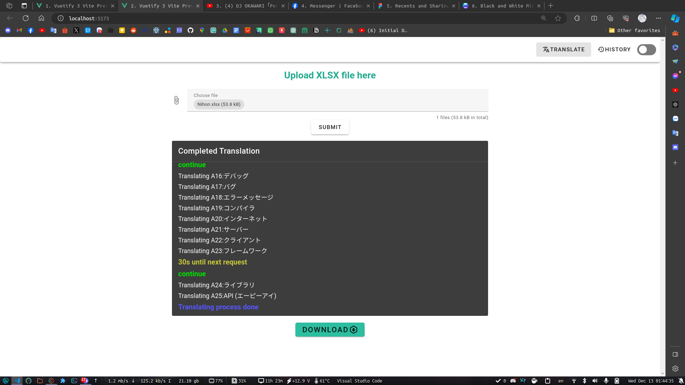

# ChatGPT-Translate-API

A project using VueJS, Flask, Socket.IO and OpenAI API to translate XLSX files from Japanese to Vietnamese, but still keeps the format such as text color, background color, images, font, size,.....
To run the project:

- Install all the dependencies needed for backend and frontend
- Replace the api_key environnment variable with your own GPT-4 Plus API key
  (due to the limitations of GPT 3.5 tier plan, the API rate limit won't be enough for large xlsx files)

Demo image:
(due to the restriction of api limit for GPT-3.5 (cuz I'm poor as hek) (which allows only 3 request per minutes, and this app reads line by line), I cannot, demonstrate a fully functional app here)

